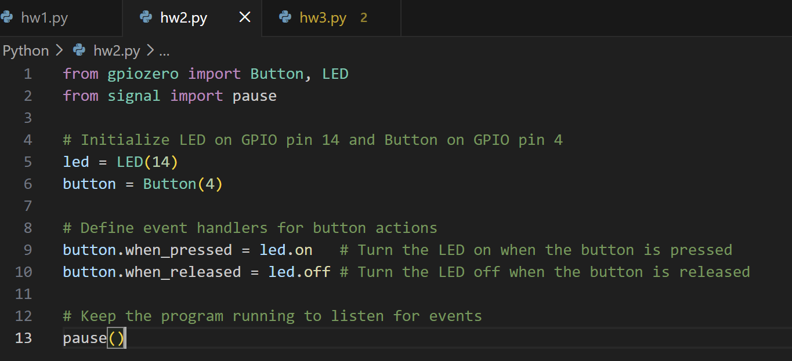
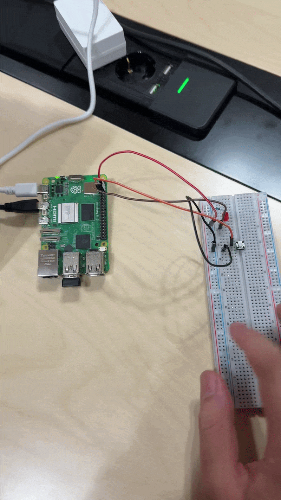

# IoT26-HW02: Read Digital Inputs with Python (Buttons and Other Peripherals)

## 1. Project Overview
- This project demonstrates how to read digital signals from external devices using Raspberry Pi's GPIO input pins. By connecting a push button, I programmed the Pi to detect physical presses and respond accordingly. This assignment highlights the use of the gpiozero interface to manage digital input states and implement basic interactive hardware logic.
## 2. Execution Screenshots
- screenshot of the IDE


## 3. Working Video
- GIF Preview:


## 4. Main Source Code
```python
from gpiozero import Button, LED
from signal import pause

# Initialize LED on GPIO pin 14 and Button on GPIO pin 4
led = LED(14)
button = Button(4)

# Define event handlers for button actions
button.when_pressed = led.on   # Turn the LED on when the button is pressed
button.when_released = led.off # Turn the LED off when the button is released

# Keep the program running to listen for events
pause()
